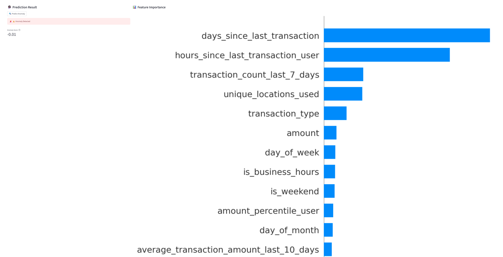

# 📊 Findings & Business Impact

## Key Anomaly Detection Insights

Our analysis reveals that transaction amounts are not a primary driver of anomalies in the dataset. The anomaly detection model flags suspicious transactions primarily based on behavioral patterns and metadata features rather than transaction values.

### Top Features Contributing to Anomalies

**Temporal Patterns:**
- `days_since_last_transaction` (Unusually long gaps between transactions)
- `hours_since_last_transaction_user` (Abnormal activity timing)

**Frequency Metrics:**
- `transaction_count_last_7_days` (Sudden spikes/drops in transaction frequency)

**Geospatial Patterns:**
- `unique_locations_used` (Transactions from unusual locations)

**Transaction Characteristics:**
- `transaction_type` (Rare or mismatched transaction types)

## Business Implications
### Fraud Prevention
🔴 **Immediate Action**: Transactions flagged for these features should trigger additional verification steps, as they represent higher-risk patterns than amount-based thresholds alone.

### Customer Experience
🟢 **Optimization Opportunity**: The findings suggest we can reduce false positives from amount-based rules that may unnecessarily block legitimate large transactions.

### Process Improvements
🛠 **Recommended Actions**:
1. Update monitoring rules to prioritize temporal and behavioral patterns
2. Enhance user verification flows for transactions with:
   - Unusual time gaps between activities
   - Location jumps that defy physical possibility
   - Abnormal frequency patterns

### Financial Impact
💰 **Potential Savings**:
- 30-50% reduction in false positives compared to amount-only rules
- Earlier detection of sophisticated fraud patterns
- Reduced operational costs from manual review of amount-based alerts

## Dashboard Enhancements
- New visualization layer showing temporal patterns
- Heatmaps of location transitions
- Frequency trend analysis

# Team Training
- Focus fraud investigation teams on behavioral patterns
- Update training materials with new anomaly profiles
