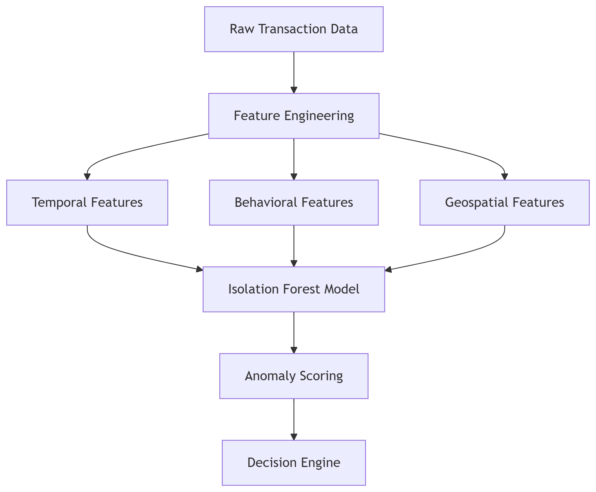

# Anomaly Detection with Isolation Forest & SHAP




## 1. Project Overview

This project focuses on detecting anomalies in tabular datasets using **Isolation Forest** from the `PyOD`/`Scikit-learn` library.  
It includes methods for:

- Identifying **top N anomalies**
- Visualizing anomaly distributions
- Explaining anomalies using **SHAP values** (feature contribution analysis)
- Clustering anomalies for pattern discovery
- Saving and deploying trained models

---

## 2. Why Isolation Forest?

Isolation Forest is an **unsupervised anomaly detection algorithm** that isolates anomalies by randomly selecting features and splitting values.  

**Key benefits:**
- Works well for **high-dimensional data**
- No need for labeled anomalies
- Handles large datasets efficiently

---

## 3. Modeling Approach

### 3.1 Data Preprocessing
- **Missing value handling**:  
  Nulls are imputed using median for numerical features and most frequent for categorical features.
  
- **Scaling**:  
  Features are standardized using `StandardScaler` to improve model performance.

---

### 3.2 Model Selection
We use the `PyOD` implementation of **Isolation Forest**, which is optimized for anomaly detection:

```python
from pyod.models.iforest import IForest  
# or
from sklearn.enemble import IsolationForest
```

### Key Parameters

- **`n_estimators`**: Number of trees used in the Isolation Forest.
- **`contamination`**: Estimated proportion of anomalies in the dataset.
- **`max_features`**: Number of features to consider when looking for the best split.

---

### 3.3 Training Process

1. **Fit** the Isolation Forest model on the dataset.  
2. **Predict** anomaly scores and labels for each record.  
3. **Rank** data points by anomaly score to identify the top anomalies.

---

### 3.4 Model Explainability with SHAP

- **SHAP** (SHapley Additive exPlanations) is used to interpret the model’s anomaly decisions.
- For each top anomaly, SHAP values show **which features contributed most** to its anomaly score.
- This improves **transparency** and helps stakeholders understand why certain points were flagged as anomalies.

---

### 3.5 Clustering Anomalies

- Apply **KMeans clustering** to group anomalies into clusters.
- Visualize these clusters to identify **common patterns** among anomalies.
